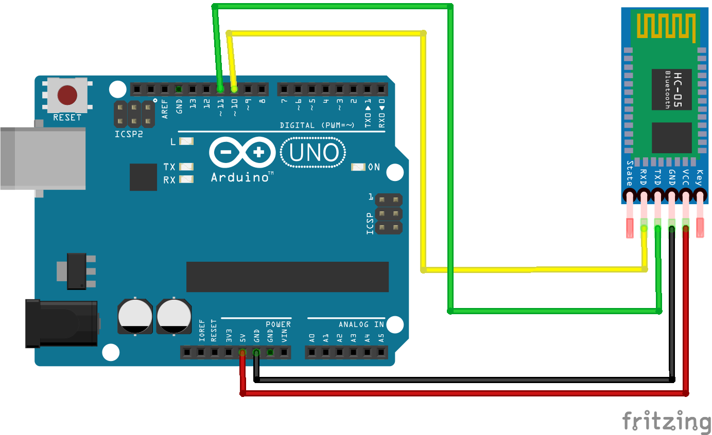

# Nombre del proyecto
Ejemplo: Control de velocidad de motor DC con PWM

## Descripción
Explica brevemente qué hace el proyecto, cuál es su propósito y qué problema resuelve.
Debe ser un párrafo corto y claro.

## Objetivos de aprendizaje
Lista de los conceptos que el alumno aprendió en esta práctica:
- Entradas/salidas digitales
- Lectura de sensores
- PWM
- Interrupciones
- IoT (si aplica)
- Control PID (si aplica)

## Material utilizado
Enumera todos los componentes usados:
- Arduino Uno R4 WiFi / Arduino Uno Q
- Sensor(es)
- Motor(es)
- Driver
- Protoboard
- Cables Dupont

## Diagrama del circuito

## Código
[main.ino](Codigo/main.ino)

## Video del funcionamiento

[Video](Video/video.txt)

[Ver video en YouTube](https://www.youtube.com/watch?v=T5Aq7cRc-mU)
## Resultados
Incluye:
[valor.txt](Resultados/valor.txt)

- Gráficas (insertar imagen o link)
- Tablas de datos
- Observaciones sobre el comportamiento del sistema

## Conclusiones
Explica qué aprendiste, qué funcionó bien, qué podría mejorarse y qué aplicaciones tendría este proyecto.

## Archivos adicionales
- Reporte técnico estilo IEEE (PDF)
- Datos CSV (si aplica)
- Diagramas adicionales

